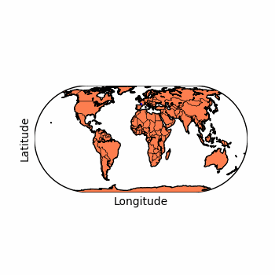
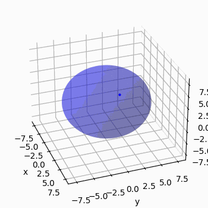

# SatelliteTrajectories
Quick and dirty modelling of satellite trajectories around Earth. 

  
  
  

## Introduction
This project is a simple simulation of satellite trajectories around Earth. The orbital motion is modelled using both inertial 
coordinates and Earth-fixed, co-rotating spherical polar coordinates.

The inertial coordinates are used to model the motion of the
satellite in the inertial reference frame. The obtained results of the simulation are then translated to cartesian coordinates
and shown as a 3D plot of the satellite motion above earth surface.

The Earth-fixed, co-rotating spherical polar coordinates are used to model the motion of the satellite in the Earth-fixed
reference frame, which is useful for tracking the satellite motion above the Earth surface. The obtained results of the
simulation (latitude and longitude) are then shown as a 2D plot of the satellite motion on a projection of Earth 
surface (Mercator and Eckert IV).

The oblateness of the Earth is omitted in the equations of motion, so the Earth is considered a perfect sphere.

## Simulations
The simulations are made using scipy and its solve ivp function for solving ordinary
differential equations. For each experiment, 10000 samples were obtained from the solution to the differentials
equations (10000 positions of the tracked body).

The initial conditions for the simulations are given by:
- altitude (in km), 
- colatitude and it’s rate of change,
- longitude and it’s rate of change and,
- duration of the simulation (in seconds).

## Limitations
Watch out for numerical instabilities that may arise from some initial conditions, switching scipy solvers 
may help in some cases.

## Requirements
Run with >= Python 3.10, requirements are available in requirements.txt.
